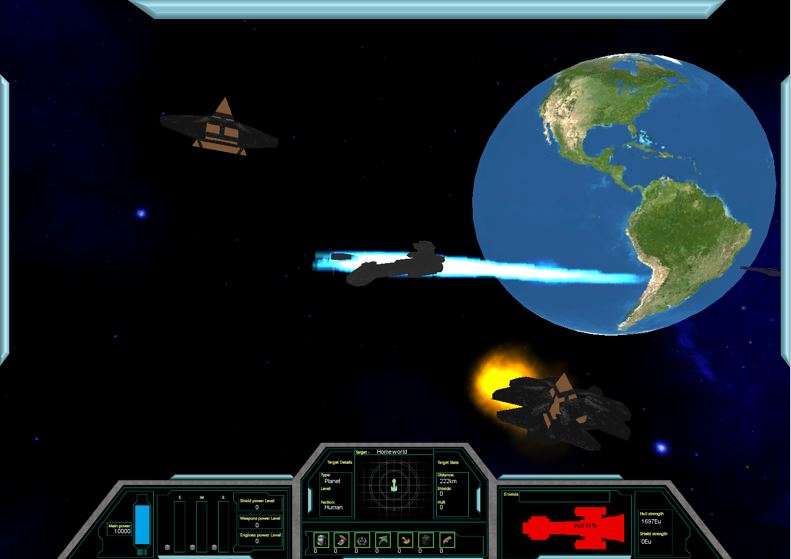

# StargateGalaxy

A Unity game developed as a group in 2011 for a 3rd year capstone project. The group who worked on the project were Peter Mitchell (myself), Phil Lavender, Andrew Krix, Karlos Lavender, Kane Stone. The roles I covered on the project included: Project Manager, Lead Programmer, Lead AI Programmer, Lead Tester, and Co-lead Editor. You can find the roles of others listed in the Project Management Plan on page 19. I have provided a lot of the documentation we produced alongside the game. This project was developed simultaneously with overlapping members working on one of my other games [Chad's Challenge](https://github.com/Squirrelbear/ChadsChallengeDemoCopy).

See the User Manual for instructions on how to play. 

Note that the Unity project uses Unity version 3.3.0.

StargateGalaxy_x86Build.zip contains a build of the game.

- ([Youtube Demo](https://youtu.be/YiR4QwfVw_I))

